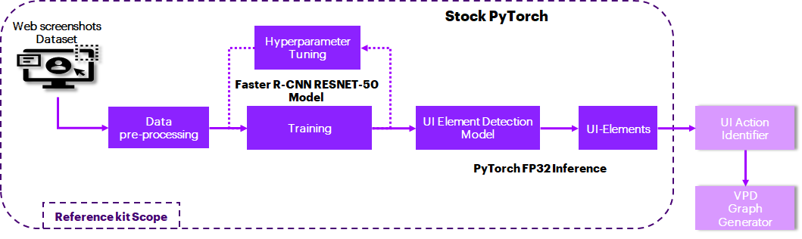
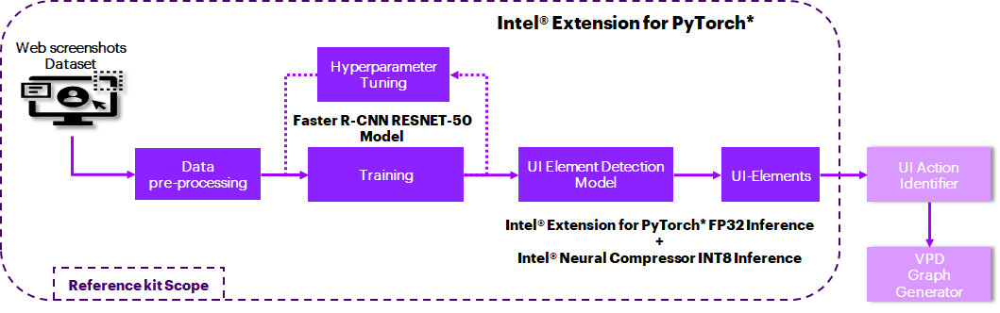
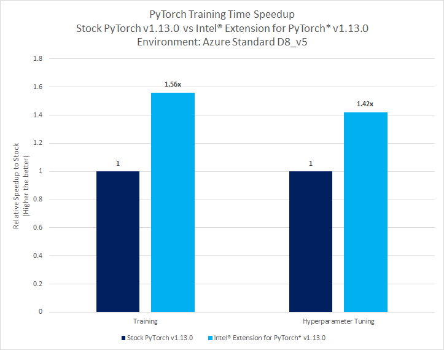
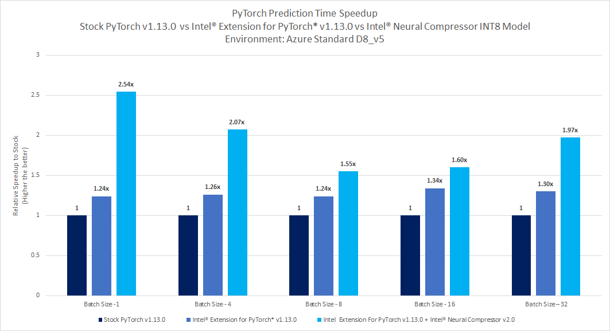

# Applications of Visual Process Discovery Using PyTorch
## Introduction
Process discovery has been crucial for businesses from traditional times to understand the existing business process flows at every level and identify the gaps and bottlenecks to improve productivity. With the growing digitization of businesses, visual process discovery tools and techniques have found broad applications across multiple industries.

## Table of Contents 
 - [Purpose](#purpose)
 - [Reference Solution](#reference-solution)
 - [Reference Implementation](#reference-implementation)
 - [Intel® Optimized Implementation](#optimizing-the-end-to-end-solution-with-intel%C2%AE-oneapi-components)
 - [Performance Observations](#performance-observations)

## Purpose

As more and more enterprises transform their operations to digital mode, it becomes critical to get detailed granular-level insights on how their users/stakeholders interact with enterprises to understand and provide better experiences to the users. They depend on expensive external subject matter experts or consultants to do the process investigation. Also, due to insufficient documentation, the as-is process is frequently not well defined, and organizations mostly fail to offer the necessary inputs to identify important concerns. Relying solely on human expertise to understand the business processes would not result in optimal process changes.

Visual process discovery (VPD) captures real-time interactions between users and workflows; maps and analyses the workflows and provides objective data-driven insights to enhance processes; and identifies processes that can be automated using Robotic Process Automation (RPA).

For example, in the financial services sector, VPD can help enhance its customer experience by providing personalized solutions knowing their needs as they navigate through the company's websites; even help improve and automate loan processing, suspicious activity report generation, customer onboarding and account opening/closure, Know Your Customer (KYC) and other repetitive processes.

Deep Learning algorithms can anticipate UI components from screenshots taken from the website and analyze sophisticated features quickly and efficiently. Generating a near-real-time report of recognized UI components through RPA on a low-power edge device is critical.

## Reference Solution  
The reference solution aims to detect the UI elements (Buttons, Links, Texts, Images, Headings, Fields, Labels, IFrames) from the website screenshots using a PyTorch-based Deep Learning model.

This reference kit uses an advanced PyTorch-based pre-trained Faster R-CNN RESNET-50 model to perform transfer learning on a Roboflow Website Screenshots dataset. This model is an object detection algorithm that enables the Convolutional Neural Network (CNN) itself to learn the Region Proposals and is further trained to detect UI elements in the input website screenshot. A promising technique to detect UI components from website screenshots is the Faster R-CNN RESNET-50 object detection model. Any visual process automation might use this trained model to replace the UI element detection module.

Edge-deployed AI model offers real-time analysis of UI element detection, conducting computation at extremely low latency, boosting the whole visual process discovery. Thus, by quantizing/compressing the model (from floating point to integer model), while maintaining a similar level of accuracy as the floating point model, efficient utilization of underlying resources can be demonstrated when deployed on edge devices with low processing and memory capabilities.

Since GPUs are typically the choice for Deep Learning and AI processing to achieve a higher Frames Per Second (FPS) rate, to offer a more cost-effective option leveraging a CPU, the quantization technique can be used, leveraging Intel® Analytics toolkit, to achieve a high FPS by performing vectorized operations on CPUs itself.
## Key Implementation Details

- Highlighted the performance gain using Intel® oneAPI packages especially, Intel® Extension for PyTorch* v1.13.0 over the stock version of PyTorch v1.13.0.
- Used the pre-trained Faster R-CNN RESNET-50 model to detect UI elements in the input website screenshots. Captured training time and hyperparameter-tuning time, inference time and model accuracy for multiple runs on both stock version and Intel® oneAPI version. Compared the averages of these runs.
- Quantized model using Intel® Neural Compressor that has shown high-performance vectorized operations on Intel® platforms.

## Reference Implementation
### Use Case End-To-End flow

### Expected Input-Output


|              **Input**               |   **Output**   |
|:------------------------------------:|-----|
| Website Screenshot |   UI Elements (Buttons, Links, Texts, Images, Headings, Fields, Labels, IFrames)  |


### Reference Sources

*DataSet*: https://public.roboflow.com/object-detection/website-screenshots/1 (236 MB dataset for this use case)<br>
*Case Study & Repo*: https://github.com/harshatejas/pytorch_custom_object_detection 

> ***Please see this data set's applicable license for terms and conditions. Intel®Corporation does not own the rights to this data set and does not confer any rights to it.***

### Repository clone and Anaconda installation

```
git clone https://github.com/oneapi-src/visual-process-discovery
cd visual-process-discovery
```

> **Note**: If you are beginning to explore the reference kits on client machines such as a windows laptop, go to the [Running on Windows](#running-on-windows) section to ensure you are all set and come back here

> **Note**: The performance measurements were captured on Xeon based processors. The instructions will work on WSL, however some portions of the reference kits may run slower on a client machine, so utilize the flags supported to modify the epochs/batch size to run the training or inference faster. Additionally performance claims reported may not be seen on a windows based client machine.

> In this reference kit implementation already provides the necessary conda environment configurations to set up the software requirements. To utilize these environment scripts, first, install Anaconda/Miniconda by following the instructions at the following link<br>[Anaconda installation](https://docs.anaconda.com/anaconda/install/linux/)

### Usage and Instructions

Below are the steps to reproduce the benchmarking results given in this repository
1. Creating the execution environment
2. Dataset preparation
3. Training Faster R-CNN RESNET-50 model
4. Hyperparameter Tuning & Evaluation
5. Model Inference
6. Quantize trained models using Intel® Neural Compressor and benchmarking
7. Observations


### Software Requirements
| **Package**              | **Stock Python**                   
|:-------------------------| :---                               
| Python                   | python==3.9.12                       
| PyTorch                  | pytorch==1.13.0                 

### Environment
Below are the developer environment used for this module on Azure. All the observations captured are based on this environment setup.


| **Size** | **CPU Cores** | **Memory** | **Intel® CPU Family** |
|----------|:-------------:|:----------:|:---------------------:|
|    NA    |       8       |    32GB    |        ICELAKE        |

### Solution setup
The below file is used to create an environment as follows:


|        **YAML file**         | **Environment Name** |           **Configuration**            |
|:----------------------------:|----------------------|:--------------------------------------:|
| `env/stock/stock-visual.yml` |     `stock-visual`      | Python=3.9.12 with stock PyTorch 1.13.0 |

### Dataset
The Roboflow Website Screenshots dataset is composed of screenshots from over 1.2K of the world's top websites. Annotated screenshots are very useful in Robotic Process Automation. 

| **Use case**                   | Visual Process Discovery
|:-------------------------------| :---
| **Objects of interest**         | Buttons, Links, Texts, Images, Headings, Fields, Labels, IFrames 
| **Size**                       | Total 1206 Labelled Images<br>
| **Source**                     | https://public.roboflow.com/object-detection/website-screenshots/1


### Training
To identify Region Proposals, Faster R-CNN employs Selective Search on the layers of the Convolutional Neural Network itself. Faster R-CNN employs an object detection approach that allows the Convolutional Neural Network to learn Region Proposals and objects of interest from the input web screenshots. PyTorch v1.13.0 is used to perfrom transfer learning using Faster R-CNN RESNET-50 object detection architecture on a dataset that has been downloaded and preprocessed with OpenCV and NumPy.


| **Input Image Dimension** | 1024x768 (preprocessed data)
| :--- | :---
| **Output Model format** | PyTorch
  **Output**  | UI Elements (Buttons, Links, Texts, Images, Headings, Fields, Labels, IFrames)

### Inference
Performed inferencing on the trained model using Stock PyTorch v1.13.0.

#### 1. Environment Creation
**Setting up the environment for Stock PyTorch**<br>Follow the below conda installation commands to set up the Stock PyTorch environment for the model training and prediction. 
```sh
conda env create -f env/stock/stock-visual.yml
```

*Activate stock conda environment*

Use the following command to activate the environment that was created:

```sh
conda activate stock-visual
```

#### 2. Data preparation
> The Roboflow Website Screenshots Dataset is downloaded and extracted in a folder before running the training python module. Elements are annotated in Pascal VOC format.

> **Note**: For model building 19 images from the dataset were used for testing, 198 images for training, and 49 images for validation. Details of the image names can be found in the text files named "train.txt," "test.txt," and "valid.txt" inside the "data" folder. 

```sh
cd data

curl -L "https://public.roboflow.com/ds/nEKEk2xTVl?key=5RsNd1Ak4t" > roboflow.zip
unzip roboflow.zip 

rm roboflow.zip
cd ../
```

The folder structure Looks as below after extraction of the dataset.
```
- data
    - train
    - valid
    - test
```

> **Note**: For step by step description for the above instructions to download the dataset, refer to the data.txt file inside the data folder.

> **Now the data folder contains the below structure** 
<br>data="data/{train/valid/test}"

#### 3. Training Faster R-CNN RESNET-50 model
Run the training module as given below to start training using the active environment. 

This module takes option to run the training.
```
usage: training.py [-h] [-d DATA_PATH] [-c CHECKPOINT_PATH] [-o OUTPUT_MODEL_PATH] [-hy HYPERPARAMETER_TUNING]
                   [-i INTEL] [-ep NUMBER_OF_EPOCHS]

optional arguments:
  -h, --help            show this help message and exit
  -d DATA_PATH, --data_path DATA_PATH
                        dataset path which consists of train and valid folders
  -c CHECKPOINT_PATH, --checkpoint_path CHECKPOINT_PATH
                        use absolute path to load the model for tuning, default is None
  -o OUTPUT_MODEL_PATH, --output_model_path OUTPUT_MODEL_PATH
                        output file name without extension to save the model
  -hy HYPERPARAMETER_TUNING, --hyperparameter_tuning HYPERPARAMETER_TUNING
                        use 1 for hyperparameter tuning , default is 0
  -i INTEL, --intel INTEL
                        use 1 for enabling intel pytorch optimizations, default is 0
  -ep NUMBER_OF_EPOCHS, --number_of_epochs NUMBER_OF_EPOCHS
                        Number of epochs used to train the model , default is 10
```
**Command to run training**
```sh
python src/training.py -d data -o models/stock/default -ep 10
```

**Expected Output**<br>
>The output trained model will be saved in `models/stock/default` as `vpd_model`. Training time in seconds would be generated at the end of the training module for 10 epochs.

#### 4. Hyperparameter Tuning & Evaluation

**Command to run Hyperparameter tuning**
```sh
python src/training.py -d data -c models/stock/default/vpd_model -o models/stock/tuning -hy 1
```
> The output tuned model would be saved in `models/stock/tuning` as `vpd_best_model`.

**Hyperparameters used here are as below**

Dataset used with a 70:20 split for training and validation.
- Batch Size = 8 
- Epochs = 2
- Learning Rates      : [0.0001, 0.005]
- Optimizers          : ["Adam", "SGD"]

> We recommend using the model trained using a regular training module as the starting point for Hyperparameter tuning. So that one can identify the best possible combinations to get better accuracy.<br>

>Note: The test mAP of the model could be improved further by (1) Adding more data samples (2) Training for more epochs (3) Extending hyperparameter tuning for varied learning rates, optimizers etc.

*Evaluating the model on Test Dataset*

Run the evaluation module to find out the mAP.
```
usage: evaluation.py [-h] [-d DATASET] [-i INTEL] [-c CHECKPOINT_PATH]

optional arguments:
  -h, --help            show this help message and exit
  -d DATASET, --dataset DATASET
                        dataset path which consists of test folder
  -i INTEL, --intel INTEL
                        use 1 for enabling intel pytorch optimizations, default is 0
  -c CHECKPOINT_PATH, --checkpoint_path CHECKPOINT_PATH
                        use 1 for enabling intel pytorch optimizations, default is 0
```

**Command to run evaluation**

```sh
python src/evaluation.py -d data -c models/stock/tuning/vpd_best_model
```

#### 5. Inference
*Running inference using Test dataset*

```
usage: inference.py [-h] [-d DATASET] [-i INTEL] [-c CHECKPOINT_PATH] [-b TEST_BATCH_SIZE]

optional arguments:
  -h, --help            show this help message and exit
  -d DATASET, --dataset DATASET
                        dataset path which consists of test folder
  -i INTEL, --intel INTEL
                        use 1 for enabling intel pytorch optimizations, default is 0
  -c CHECKPOINT_PATH, --checkpoint_path CHECKPOINT_PATH
                        use 1 for enabling intel pytorch optimizations, default is 0
  -b TEST_BATCH_SIZE, --test_batch_size TEST_BATCH_SIZE
                        use different batch sizes, default is 1
```
**Command to run inference**

```sh
python src/inference.py -d data -c models/stock/tuning/vpd_best_model -b 1 
```
> Above inference script can be run using different batch sizes. Use `-b` to test with different batch sizes (e.g. `-b 10`) <br>

## Optimizing the End To End solution with Intel® oneAPI components
### Use Case End-To-End flow


### Optimized software requirements

| **Package**               | **Intel® Python**                   
|:--------------------------| :---                               
| Python                    | python==3.9.12
| Intel® Extension for PyTorch*                   | intel-extension-for-pytorch==1.13.0
| Intel® Neural Compressor | neural-compressor==2.0

**YAML file**                                 | **Environment Name** |            **Configuration**             |
| :---: |:--------------------:|:----------------------------------------:|
`env/intel/intel-visual.yml`             |     `intel-visual`      | Python=3.9.12 with Intel® Extension for PyTorch* v1.13.0 |


### 1. Environment Creation

**Before setting up the Intel environment please deactivate the existing Stock environment by executing the below**
```sh
conda deactivate 
``` 

**Setting up the environment for Intel® Extension for PyTorch**<br>Follow the below conda installation commands to set up the Intel® Extension for PyTorch* environment for the model training and prediction.
```sh
conda env create -f env/intel/intel-visual.yml
```

**Activate intel conda environment**
<br>Use the following command to activate the environment that was created:
```sh
conda activate intel-visual
```

#### 2. Training Faster R-CNN RESNET-50 model
Run the training module as given below to start training using the active environment. 

This module takes the option to run the training.

**Command to run training**

```sh
python src/training.py -d data -o models/intel/default -ep 10 -i 1
```

> The output trained model would be saved in `models/intel/default` as `vpd_model`. Training time in seconds would be generated at the end of the training module for 10 epochs.

#### 3. Hyperparameter Tuning & Evaluation

**Command to run Hyperparameter tuning**
```sh
python src/training.py -d data -c models/intel/default/vpd_model -o models/intel/tuning -hy 1 -i 1
```
> The output tuned model would be saved in `models/intel/tuning` as `vpd_best_model`.

**Hyperparameters used here are as below**

Dataset remains the same with a 70:20 split for training and validation.
- Batch Size = 8 
- Epochs = 2
- Learning Rates      : [0.0001, 0.005]
- Optimizers          : ["Adam", "SGD"]


> We recommend using the model trained using a regular training module as the starting point for Hyperparameter tuning. So that one can identify the best possible combinations to get better accuracy.<br>

>Note: The test mAP of the model could be improved further by (1) Adding more data samples (2) Training for more epochs (3) Extending hyperparameter tuning for varied learning rates, optimizers etc.

*Evaluating the model on Test Dataset*

Run the evaluation module to find out the mAP.

**Command to run evaluation**
```sh
python src/evaluation.py -d data -i 1 -c models/intel/tuning/vpd_best_model 
```

#### 4. Inference
*Running inference using test dataset and PyTorch*

**Command to run inference**

```sh
python src/inference.py -d data -i 1 -c models/intel/tuning/vpd_best_model -b 1
```
> Above inference script can be run using different batch sizes. Use `-b` to test with different batch sizes (e.g. `-b 10`) <br>


#### 5. Quantize trained models using Intel® Neural Compressor
Intel® Neural Compressor is used to quantize the FP32 Model to the INT8 Model. An optimized model is used here for evaluating and timing analysis.
Intel® Neural Compressor supports many optimization methods. In this case, we used the post-training accuracy aware quantization method to quantize the FP32 model.

*Step-1: Conversion of FP32 Model to INT8 Model also called the Quantization*

```
usage: run_quantization.py [-h] [-o OUTPATH] [-d DATAPATH] [-c CHECKPOINT_PATH]

optional arguments:
  -h, --help            show this help message and exit
  -o OUTPATH, --outpath OUTPATH
                        absolute path to save quantized model. By default it will be saved in "./inc_compressed_model/output" folder
  -d DATAPATH, --datapath DATAPATH
                        Path to test dataset folder
  -c CHECKPOINT_PATH, --checkpoint_path CHECKPOINT_PATH
                        path to load the quantization model
```

**Command to run the neural_compressor_conversion**

**Note**: Activate Intel® Environment before running
```sh
python src/intel_neural_compressor/run_quantization.py -o models/inc_compressed_model/output -d data -c models/intel/tuning/vpd_best_model
```
> Quantized model will be saved by default in `models/inc_compressed_model/output` folder 


*Step-2: Inferencing using quantized Model*
```
usage: run_quant_inference.py [-h] [-d DATA_PATH] [-b BATCH_SIZE] [-qw QUANT_WEIGHTS] [-eval EVAL_MODE]

optional arguments:
  -h, --help            show this help message and exit
  -d DATA_PATH, --data_path DATA_PATH
                        path to the test data
  -b BATCH_SIZE, --batch_size BATCH_SIZE
                        batch size for the dataloader....default is 1
  -qw QUANT_WEIGHTS, --quant_weights QUANT_WEIGHTS
                        Quantization Model Weights folder containing ".pt" format model
  -eval EVAL_MODE, --eval_mode EVAL_MODE
                        Enable evaluation mode to evaluate quantized model...default is False                   
```
*Command to run inference for realtime `(batchsize =1)`*
```sh
python src/intel_neural_compressor/run_quant_inference.py -d data -b 1 -qw models/inc_compressed_model/output

```
> Use `-b` to test with different batch size (e.g. `-b 10`)

*Command to run evaluation with quantized model*
```sh
python src/intel_neural_compressor/run_quant_inference.py -d data -b 1 -qw models/inc_compressed_model/output -eval True

```

```sh
conda deactivate 
``` 


## Performance Observations

This section covers the training time and inference time comparison between Stock PyTorch v1.13.0 and Intel® Extension for PyTorch* v1.13.0.

### Training and Hyperparameter tuning  benchmarking results: Stock PyTorch v1.13.0 vs Intel® Extension for PyTorch* v1.13.0




<br>**Key Takeaways**<br>
Intel® Extension for PyTorch* v1.13.0 offers speed up of training time up to 1.56x during regular model training and up to 1.42x speed up during hyperparameter tuned training, as compared to the Stock PyTorch v1.13.0.

### Inference benchmarking results: Stock PyTorch v1.13.0 FP32 Model vs Intel® Extension for PyTorch* v1.13.0 FP32 Model vs Intel® Neural Compressor INT8 Model.




<br>**Key Takeaways**<br>

-  Realtime prediction time with Intel® Extension for PyTorch* v1.13.0 FP32 Model shows up to 1.24x against Stock PyTorch v1.13.0 FP32 Model
-  Batch prediction time speedup with Intel® Extension for PyTorch* v1.13.0 FP32 Model shows up to 1.34x against Stock PyTorch v1.13.0 FP32 Model
-  Intel® Neural Compressor quantization offers real-time prediction time speedup of up to  2.54x against Stock PyTorch v1.13.0  FP32 model
-  Intel® Neural Compressor quantization offers batch prediction time speedup of up to 2.07x against the Stock PyTorch v1.13.0 FP32 model.
-  Accuracy drop of only 0.001% is observed post-quantization of the FP32 model in both phases, which is around 57% for 10 epochs of training.
-  Model Footprint is reduced from 158 MB to 40 MB (~75% Compressed)

## Conclusion
To build a webpage UI elements detection model for visual process discovery using the Deep Learning approach, machine learning engineers will need to train models with a large dataset and run inference more frequently. The accelerated training will allow them to train their models more frequently to achieve better accuracy. With faster inferencing speeds, they will be able to implement predictions in real time for faster process automation.

This reference kit implementation provides a performance-optimized guide for building an optimal UI element detection model that can be used on website screenshots to test efficient and successful process automation.

### Notices & Disclaimers
Performance varies by use, configuration, and other factors. Learn more on the [Performance Index site](https://edc.intel.com/content/www/us/en/products/performance/benchmarks/overview/). 
Performance results are based on testing as of dates shown in configurations and may not reflect all publicly available updates.  See backup for configuration details.  No product or component can be absolutely secure. 
Your costs and results may vary. 
Intel technologies may require enabled hardware, software, or service activation.
© Intel Corporation.  Intel, the Intel logo, and other Intel marks are trademarks of Intel Corporation or its subsidiaries.  Other names and brands may be claimed as the property of others.  


## Appendix

### **Running on Windows**

The reference kits commands are linux based, in order to run this on Windows, goto Start and open WSL and follow the same steps as running on a linux machine starting from git clone instructions. If WSL is not installed you can [install WSL](https://learn.microsoft.com/en-us/windows/wsl/install).

> **Note** If WSL is installed and not opening, goto Start ---> Turn Windows feature on or off and make sure Windows Subsystem for Linux is checked. Restart the system after enabling it for the changes to reflect.

### **Experiment Setup**
- Testing performed on: March 2023
- Testing performed by: Intel Corporation
- Configuration Details: Azure Standard_D8_V5 (Intel(R) Xeon(R) Platinum 8370C CPU @ 2.80GHz), 1 Socket, 4 Cores per Socket, 2 Threads per Core, Turbo:On, Total Memory: 32 GB, OS: Ubuntu 20.04, Kernel: Linux 5.13.0-1031-azure , Software: Intel® Extension for PyTorch* v1.13.0, Intel® Neural Compressor v2.0 

| Platform                          | Ubuntu 20.04
| :---                              | :---
| Hardware                          | Azure Standard_D8_V5 (Icelake)
| Software                          | Intel® Extension for PyTorch*, Intel® Neural Compressor.
| What you will learn               | Advantage of using components in Intel® oneAPI AI Analytics Toolkit over the stock version for the computer vision-based model build and inferencing.

### Known Issues

1. Environment Creation Issue: Could not build wheels for pycocotools

    **Issue:**
      When creating an intel environment using `intel-visual` 
      ```
      error: command 'gcc' failed: No such file or directory
      ERROR: Could not build wheels for pycocotools
      ```

    **Solution:**

    Install gcc.  For Ubuntu, this will be: 

      ```bash
      apt install gcc
      ```

2. ImportError: libGL.so.1: cannot open shared object file: No such file or directory
   
    **Issue:**
      While running the script "python src/run_quantization.py":,
      ```
      ImportError: libGL.so.1: cannot open shared object file: No such file or directory
      or
      libgthread-2.0.so.0: cannot open shared object file: No such file or directory
      ```

    **Solution:**

      Install the libgl11-mesa-glx and libglib2.0-0 libraries. For Ubuntu this will be:

      ```bash
     sudo apt install libgl1-mesa-glx
     sudo apt install libglib2.0-0
      ```
